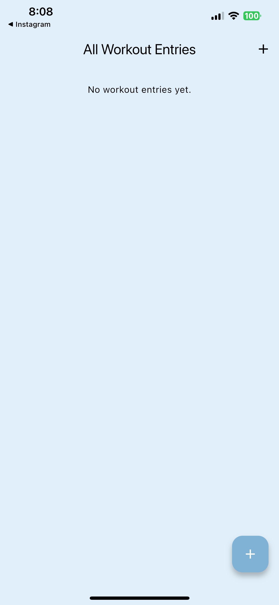
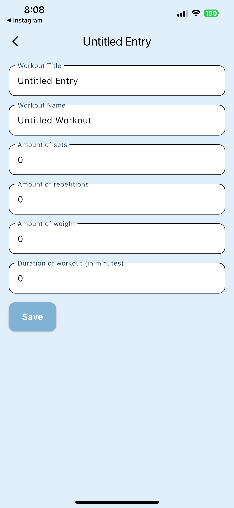
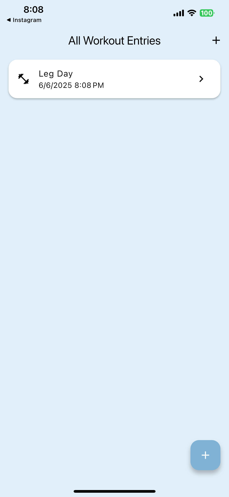

# Workout Journal

**Workout Journal** is a Flutter app that helps users log and review their workouts. It supports creating detailed entries, tracking past sessions, and maintaining personal fitness notes - all stored locally. Built with a custom UI theme and accessible design

## Features
- Add workout entries with:
  - Date & time
  - Workout type
  - Duration
  - Optional Notes
- View your workout history
- Edit previous logs
- Local data persistence using Isar
- Clean UI theme
- Accessibility-friendly followed by WCAG guidelines

## Screenshots
  

## Technologies Used
- Flutter & Dart
- Isar for fast local storage
- `provider` for state management
- `intl` for date/time formatting
- Accessibility widgets

## Project Structure

```text
lib/
├── main.dart
├── views/
│   ├── all_entries_view.dart
│   └── entry_view.dart
├── utils/
│   └── journal_mocker.dart
├── providers/
│   └── journal_provider.dart
└── models/
    ├── journal_entry.dart
    ├── journal_entry.g.dart
    └── journal.dart

```

## To get started
1. **Clone the repo**
   ```bash
   git clone https://github.com/laurxntra/journal-app.git
   cd journal-app
2. **Install dependencies**
   ```bash
   flutter pub get
3. **Install CocoaPods for iOS**
   ```bash
   cd ios
   pods install
4. **Run the app**
   ```bash
   flutter run
